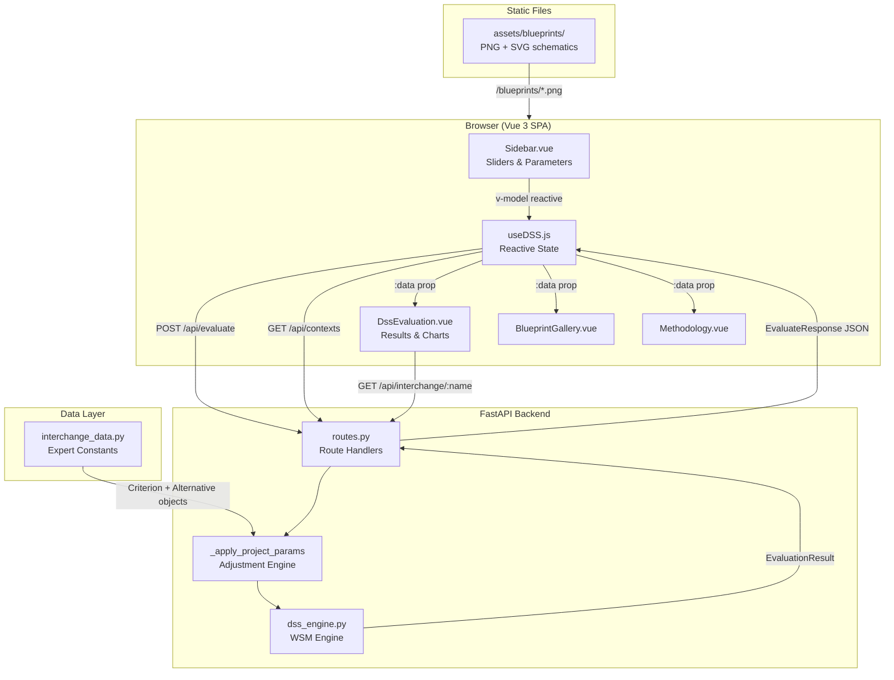
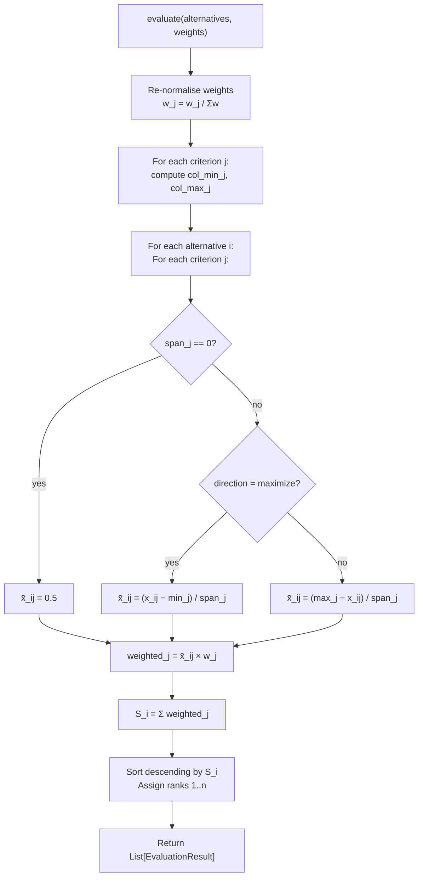
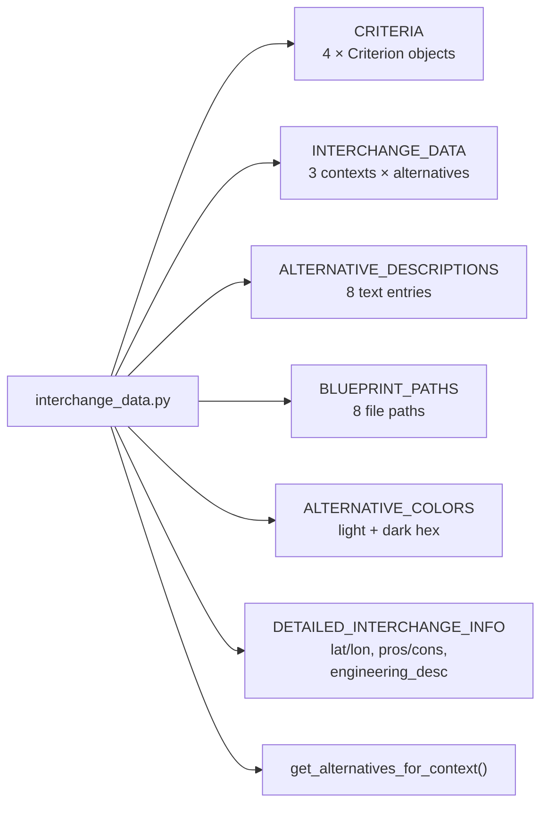
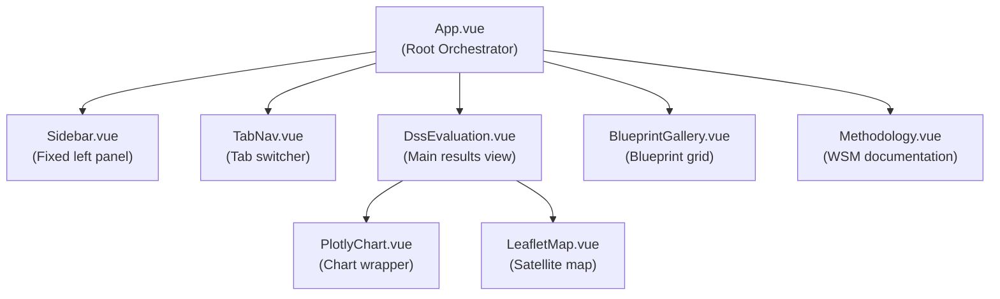
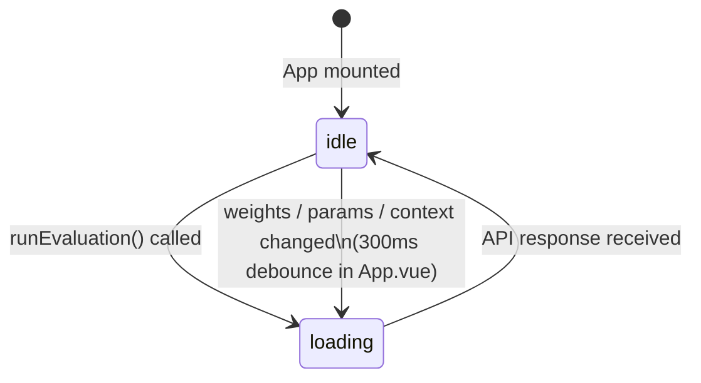
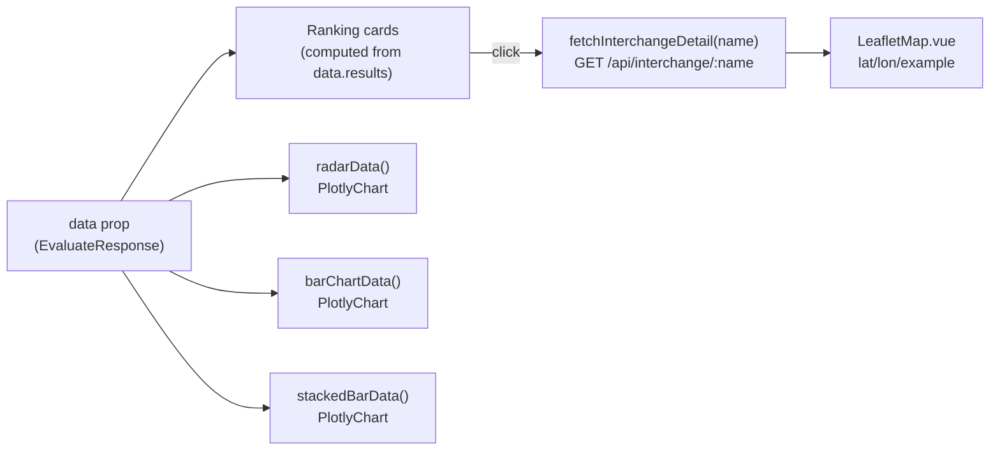
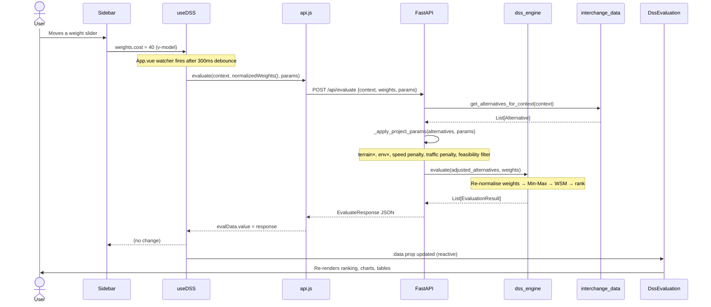

# TDSS v4 — Transport Interchange Decision Support System

> **Academic / Engineering Tool** — Multi-Criteria Decision Analysis for Highway Interchange Selection

---

## Table of Contents

1. [Project Overview](#1-project-overview)
2. [System Architecture](#2-system-architecture)
3. [Mathematical Model](#3-mathematical-model)
   - 3.1 [Weighted Sum Model (WSM)](#31-weighted-sum-model-wsm)
   - 3.2 [Min-Max Normalisation](#32-min-max-normalisation)
   - 3.3 [Weight Normalisation](#33-weight-normalisation)
   - 3.4 [Parameter Adjustment Model](#34-parameter-adjustment-model)
   - 3.5 [Feasibility Constraints](#35-feasibility-constraints)
4. [Decision Alternatives](#4-decision-alternatives)
5. [Evaluation Criteria](#5-evaluation-criteria)
6. [Backend (FastAPI)](#6-backend-fastapi)
   - 6.1 [Project Setup](#61-project-setup)
   - 6.2 [API Endpoints](#62-api-endpoints)
   - 6.3 [DSS Engine](#63-dss-engine)
   - 6.4 [Data Layer](#64-data-layer)
7. [Frontend (Vue 3)](#7-frontend-vue-3)
   - 7.1 [Project Setup](#71-project-setup)
   - 7.2 [Component Tree](#72-component-tree)
   - 7.3 [Composables (Shared State)](#73-composables-shared-state)
   - 7.4 [Component Reference](#74-component-reference)
8. [Data Flow](#8-data-flow)
9. [Localisation & Theming](#9-localisation--theming)
10. [Legacy (v3 Streamlit)](#10-legacy-v3-streamlit)
11. [Running the Project](#11-running-the-project)
12. [File & Directory Reference](#12-file--directory-reference)
13. [References](#13-references)

---

## 1. Project Overview

**TDSS** (Transport Interchange Decision Support System) is a web application designed to assist highway engineers and transport planners in selecting the optimal **grade-separated road interchange** design from a defined set of engineering alternatives.

The system applies **Multi-Criteria Decision Analysis (MCDA)** via the **Weighted Sum Model (WSM)** — also known as Simple Additive Weighting (SAW) — to objectively rank interchange types based on four quantitative engineering criteria, while accounting for site-specific conditions such as terrain, environmental sensitivity, traffic demand, and budget constraints.

### Key Features

- **8 interchange types** across 3 functional context categories
- **4 engineering criteria**: construction cost, land area, traffic throughput, safety index
- **8 project parameters** for site-specific calibration
- **4 parameter adjustment rules** that modify raw criterion values before evaluation
- **Hard feasibility filtering** (budget and land constraints)
- **Interactive ranked results** with blueprint schematics, satellite maps, and Plotly charts
- **Full bilingual support** (English / Ukrainian)
- **Dark / Light mode**
- Separated backend (FastAPI + Python) and frontend (Vue 3 + Vite)

### Version History

| Version | Stack | Location |
|---|---|---|
| v3 | Python · Streamlit · Folium | `legacy/streamlit_ui/` |
| **v4** | **Python · FastAPI · Vue 3 · Vite · Tailwind CSS** | `backend/` + `frontend/` |

---

## 2. System Architecture

The project is structured as a **strict three-layer decoupled architecture** with an additional API integration layer.



### Layer Responsibilities

| Layer | Location | Responsibility |
|---|---|---|
| **Data** | `app/data/interchange_data.py` | Expert constants only — no I/O, no maths |
| **Logic** | `app/application/dss_engine.py` | Pure WSM computation — no data, no I/O |
| **Integration** | `backend/routes.py` | Joins data + logic, applies param adjustments |
| **View** | `frontend/src/` | Renders results — never computes scores |
| **Legacy** | `legacy/streamlit_ui/` | Deprecated v3 prototype (preserved) |

---

## 3. Mathematical Model

### 3.1 Weighted Sum Model (WSM)

The WSM (also called Simple Additive Weighting) is the chosen MCDA method. It aggregates normalised criterion scores into a single composite priority score for each alternative.

**Composite score for alternative** \(i\):

$$S_i = \sum_{j=1}^{n} w_j \cdot \bar{x}_{ij}$$

where:

| Symbol | Definition |
|---|---|
| \(S_i \in [0, 1]\) | Composite WSM score for alternative \(i\) |
| \(n = 4\) | Number of evaluation criteria |
| \(w_j\) | Normalised weight for criterion \(j\) (user-adjustable, \(\sum w_j = 1\)) |
| \(\bar{x}_{ij}\) | Min-Max normalised value of criterion \(j\) for alternative \(i\) |

The alternative with the **highest** \(S_i\) is the recommended design.

---

### 3.2 Min-Max Normalisation

Raw criterion values span incompatible units (M USD, ha, veh/hr, /10). Min-Max normalisation maps every criterion to \([0, 1]\) where **1.0 always means best performer**, regardless of whether higher or lower raw values are desirable.

**For "maximize" criteria** (throughput, safety — higher is better):

$$\bar{x}_{ij} = \frac{x_{ij} - \min_j}{\max_j - \min_j}$$

**For "minimize" criteria** (cost, land area — lower is better):

$$\bar{x}_{ij} = \frac{\max_j - x_{ij}}{\max_j - \min_j}$$

**Edge case** — when all alternatives share the same value for criterion \(j\) (i.e. \(\max_j = \min_j\)):

$$\bar{x}_{ij} = 0.5 \quad \text{(neutral — no discriminating power)}$$

This prevents division by zero and assigns equal partial scores, introducing no artificial bias.

---

### 3.3 Weight Normalisation

The user sets raw integer slider values \(v_j \in [0, 100]\) for each criterion via the sidebar. These are normalised on the client before being sent to the API:

$$w_j = \frac{v_j}{\displaystyle\sum_{k=1}^{n} v_k}$$

This guarantees \(\sum w_j = 1\) regardless of raw slider totals. On the backend, weights are re-normalised a second time to guard against floating-point drift.

---

### 3.4 Parameter Adjustment Model

Before the WSM engine receives values, four independent adjustment rules may modify raw criterion data based on the user's project parameters. These adjustments are applied sequentially and are independently computed; each one may generate a human-readable `AdjustmentNote` shown in the UI.

#### Terrain Cost Multiplier

Highway construction cost scales with terrain complexity. The base cost of each alternative is multiplied by a terrain factor \(\tau\):

$$\text{cost}' = \text{cost} \times \tau, \quad \tau = \begin{cases} 1.00 & \text{Flat} \\ 1.25 & \text{Rolling} \\ 1.70 & \text{Mountainous} \end{cases}$$

#### Environmental Land Penalty

In environmentally sensitive areas, effective land consumption is penalised by a factor \(\epsilon\) to represent mitigation requirements and setback zones:

$$\text{land}' = \text{land} \times \epsilon, \quad \epsilon = \begin{cases} 1.00 & \text{Low} \\ 1.10 & \text{Medium} \\ 1.30 & \text{High} \\ 1.60 & \text{Critical} \end{cases}$$

#### Design Speed Safety Penalty

Loop-ramp interchange types (Cloverleaf, Trumpet) have structurally lower safe operating speeds. When the design speed \(V\) exceeds 80 km/h, a safety penalty \(\delta\) is applied:

$$\text{safety}' = \text{safety} \times (1 - \delta)$$

$$\delta = \min\!\left(\frac{V - 80}{20} \times 0.10,\ 0.40\right), \quad V > 80 \text{ km/h}$$

This caps the penalty at 40% regardless of design speed.

#### Traffic Demand Capacity Penalty

When peak-hour demand exceeds the alternative's maximum throughput capacity, a capacity penalty \(\kappa\) reduces the effective throughput:

$$Q_\text{peak} = \text{AADT} \times \frac{p}{100}$$

$$\text{throughput}' = \text{throughput} \times (1 - \kappa), \quad \text{if } Q_\text{peak} > \text{throughput}$$

$$\kappa = \min\!\left(\left(\frac{Q_\text{peak}}{\text{throughput}} - 1\right) \times 0.5,\ 0.40\right)$$

where \(p\) is the peak-hour factor (%) and AADT is the Annual Average Daily Traffic volume. The penalty is capped at 40%.

---

### 3.5 Feasibility Constraints

Two hard constraints are enforced **before** the WSM computation. Alternatives that fail either constraint are **removed from the evaluation set entirely** and listed in an `AdjustmentNote`:

$$\text{feasible}(i) = \begin{cases} \text{true} & \text{if } \text{cost}'_i \leq B \text{ AND } \text{land}'_i \leq L \\ \text{false} & \text{otherwise} \end{cases}$$

where \(B\) = budget limit (M USD) and \(L\) = land limit (ha). If no alternatives survive the feasibility filter, the API returns HTTP 422.

---

## 4. Decision Alternatives

The system evaluates 8 interchange types organised into 3 functional context categories.

### Context: System (Highway × Highway)

Applicable for intersections of two high-volume freeways or expressways.

| Alternative | Cost (M USD) | Land (ha) | Throughput (vph) | Safety (/10) | Notes |
|---|---|---|---|---|---|
| **Cloverleaf** | 15 | 20 | 4,000 | 4.0 | Loop ramps; weave conflicts |
| **Turbine** | 45 | 25 | 6,500 | 8.0 | Directional ramps; no weaving |
| **Stack (4-Level)** | 80 | 12 | 7,500 | 9.0 | Maximum throughput; compact |

### Context: Service (Highway × Urban)

Applicable for the junction of a high-speed highway with an urban arterial or collector road.

| Alternative | Cost (M USD) | Land (ha) | Throughput (vph) | Safety (/10) | Notes |
|---|---|---|---|---|---|
| **Diamond** | 10 | 5 | 2,500 | 5.0 | Simple; signalised at-grade ramps |
| **SPUI** | 20 | 4 | 4,500 | 7.0 | Single-point urban interchange |
| **DDI** | 18 | 6 | 5,500 | 9.0 | Diverging diamond interchange |

### Context: T-Type (3 Directions)

Applicable for three-leg junctions where one highway terminates or branches.

| Alternative | Cost (M USD) | Land (ha) | Throughput (vph) | Safety (/10) | Notes |
|---|---|---|---|---|---|
| **Trumpet** | 12 | 10 | 3,500 | 7.0 | Loop ramp for one movement |
| **Directional T** | 35 | 15 | 5,000 | 9.0 | Full directional ramps; no loops |

---

## 5. Evaluation Criteria

| Criterion | Key | Direction | Default Weight | Unit | Source |
|---|---|---|---|---|---|
| Construction Cost | `construction_cost_mln` | Minimize | 30% | M USD | FHWA, 2023 |
| Land Area | `land_area_hectares` | Minimize | 20% | ha | PIARC, 2019 |
| Traffic Throughput | `throughput_vph` | Maximize | 25% | veh/hr | TRB HCM 7th Ed. |
| Safety Index | `safety_index` | Maximize | 25% | /10 | AASHTO, 2022 |

The default weights reflect a moderate emphasis on cost and balanced weighting of operational and safety performance. Users may adjust all four weights via sliders; the system renormalises them automatically.

---

## 6. Backend (FastAPI)

### 6.1 Project Setup

**Runtime:** Python 3.11+  
**Package manager:** Poetry (`pyproject.toml`) or pip (`requirements.txt`)

```bash
# Install with pip
pip install -r requirements.txt

# Install with Poetry
poetry install

# Run the server
uvicorn backend.main:app --reload --port 8000
```

**Key dependencies:** `fastapi`, `uvicorn`, `pydantic`, `numpy`

---

### 6.2 API Endpoints

#### `GET /api/contexts`

Returns the list of available interchange context categories.

**Response:**
```json
{
  "contexts": [
    "System (Highway + Highway)",
    "Service (Highway + Urban)",
    "T-Type (3 Directions)"
  ]
}
```

---

#### `POST /api/evaluate`

The primary evaluation endpoint. Accepts project context, criterion weights, and project parameters; returns a full ranked evaluation.

**Request body:**
```json
{
  "context": "System (Highway + Highway)",
  "weights": {
    "construction_cost_mln": 0.30,
    "land_area_hectares": 0.20,
    "throughput_vph": 0.25,
    "safety_index": 0.25
  },
  "params": {
    "design_speed": 100,
    "aadt": 45000,
    "peak_factor": 10,
    "num_lanes": 2,
    "budget": 100.0,
    "land_limit": 30.0,
    "terrain": "Flat",
    "env_sensitivity": "Medium"
  }
}
```

**Response body:**
```json
{
  "context": "System (Highway + Highway)",
  "results": [
    {
      "alternative_name": "Stack (4-Level)",
      "raw_values":       { "construction_cost_mln": 80.0, "land_area_hectares": 12.0, ... },
      "normalised_values":{ "construction_cost_mln": 0.0,  "land_area_hectares": 1.0,  ... },
      "weighted_scores":  { "construction_cost_mln": 0.0,  "land_area_hectares": 0.20, ... },
      "total_score": 0.70,
      "rank": 1,
      "description": "...",
      "color": "#1d4ed8",
      "color_dark": "#93c5fd",
      "blueprint_path": "assets/blueprints/stack.png"
    }
  ],
  "criteria": [ { "name": "construction_cost_mln", "direction": "minimize", "weight": 0.30, "unit": "M USD" } ],
  "criterion_labels": { "construction_cost_mln": "Construction Cost" },
  "normalised_weights": { "construction_cost_mln": 0.30 },
  "adjustments": [
    { "kind": "env_sensitivity", "message": "Env. sensitivity 'Medium': land area scaled ×1.10" }
  ]
}
```

**Error responses:**
- `404` — context not found
- `422` — no alternatives pass the feasibility constraints

---

#### `GET /api/interchange/{name}`

Returns detailed information about a named interchange for the detail panel and Leaflet map.

**Example response for `"Stack (4-Level)"`:**
```json
{
  "name": "Stack (4-Level)",
  "lat": 29.7806,
  "lon": -95.4541,
  "example_name": "Judge Harry Pregerson Interchange, Los Angeles, CA",
  "pros": ["Maximum throughput capacity", "Fully directional ramps — no weaving"],
  "cons": ["Highest construction cost of all interchange types", "Requires deep ROW acquisition"],
  "engineering_desc": "The four-level stack interchange provides fully directional..."
}
```

---

#### `GET /blueprints/{filename}`

Serves static blueprint images from `assets/blueprints/`. Available filenames:

| Interchange | PNG | SVG |
|---|---|---|
| Cloverleaf | `cloverleaf.png` | `cloverleaf.svg` |
| Turbine | `turbine.png` | `turbine.svg` |
| Stack (4-Level) | `stack.png` | `stack.svg` |
| Diamond | `diamond.png` | `diamond.svg` |
| SPUI | `spui.png` | `spui.svg` |
| DDI | `ddi.png` | `ddi.svg` |
| Trumpet | `trumpet.png` | `trumpet.svg` |
| Directional T | `directional_t.png` | `directional_t.svg` |

---

### 6.3 DSS Engine

`app/application/dss_engine.py` is a **pure-Python, zero-dependency** implementation of the WSM algorithm. It has no knowledge of HTTP, data files, or UI concerns.



**Data classes defined in `dss_engine.py`:**

```python
@dataclass
class Criterion:
    name:      str           # "construction_cost_mln"
    direction: str           # "minimize" | "maximize"
    weight:    float         # default weight (overridden by user)
    unit:      str           # "M USD", "ha", "veh/hr", "/10"

@dataclass
class Alternative:
    name:       str
    raw_values: dict[str, float]   # {criterion_name: raw_value}
    description: str

@dataclass
class EvaluationResult:
    alternative_name:  str
    raw_values:        dict[str, float]
    normalised_values: dict[str, float]
    weighted_scores:   dict[str, float]
    total_score:       float          # Sᵢ ∈ [0, 1]
    rank:              int
```

---

### 6.4 Data Layer

`app/data/interchange_data.py` contains all expert constants and serves as the single source of truth for interchange data. **No computation is performed here.**



---

## 7. Frontend (Vue 3)

### 7.1 Project Setup

**Runtime:** Node.js 18+  
**Bundler:** Vite 6  
**Framework:** Vue 3 (Composition API)  
**Styling:** Tailwind CSS v4  
**Charts:** Plotly.js  
**Maps:** Leaflet + Esri World Imagery (satellite tiles)

```bash
cd frontend
npm install
npm run dev      # development server at http://localhost:5173
npm run build    # production build to frontend/dist/
```

The Vite dev server proxies `/api` and `/blueprints` to `http://localhost:8000` (the FastAPI backend).

---

### 7.2 Component Tree



All components except `PlotlyChart` and `LeafletMap` are displayed via `v-show` (kept in DOM; no re-mount cost on tab switch).

---

### 7.3 Composables (Shared State)

The application uses Vue's Composition API with **module-level singleton state** — `useDSS`, `useLocale`, and `useTheme` each create their reactive state once at the module level and share it across all component instances.

#### `useDSS.js` — Core Evaluation State



Exports:

| Export | Type | Description |
|---|---|---|
| `contexts` | `Ref<string[]>` | Available context names from API |
| `selectedContext` | `Ref<string>` | Currently selected context |
| `loading` | `Ref<boolean>` | True while API call is in flight |
| `evalData` | `Ref<object\|null>` | Last `EvaluateResponse` from API |
| `weights` | `Reactive<object>` | Raw slider values (0–100) per criterion |
| `params` | `Reactive<object>` | 8 project parameters |
| `normalizedWeights()` | `Function` | Converts raw weights → fractions summing to 1 |
| `loadContexts()` | `async Function` | Fetches `/api/contexts`, sets `selectedContext` |
| `runEvaluation()` | `async Function` | POSTs to `/api/evaluate`, updates `evalData` |

#### `useLocale.js` — Internationalisation

Provides a complete EN/UA translation dictionary. All UI strings are keyed through `t.value.<key>`. Switching language is instant (reactive computed).

#### `useTheme.js` — Theme

Manages the `dark` boolean ref and syncs the `dark` CSS class on the `<html>` element via `watchEffect`.

---

### 7.4 Component Reference

#### `App.vue` — Root Orchestrator

Responsible for:
- Mounting all top-level components
- Triggering initial data load (`loadContexts` → `runEvaluation`)
- Watching `selectedContext`, `weights`, `params` with a 300ms debounce and re-running evaluation on change
- Passing `evalData` as `:data` prop to all three tab components
- Rendering the ambient glassmorphism background blobs (light mode)
- Showing a loading spinner overlay while `dss.loading` is true

---

#### `Sidebar.vue` — Left Control Panel

Fixed-position left panel (320px). Contains all user inputs.

```
┌─────────────────────────┐
│ TDSS v4  [EN/UA] [☀/☾]  │
├─────────────────────────┤
│ Context Selector        │
│  ▼ System (Hwy + Hwy)   │
├─────────────────────────┤
│ Criteria Weights        │
│  Cost       ████░ 30%   │
│  Land       ███░░ 20%   │
│  Throughput ████░ 25%   │
│  Safety     ████░ 25%   │
├─────────────────────────┤
│ Project Parameters      │
│  Design Speed: 100 km/h │
│  AADT: 45,000 veh/day   │
│  Peak Factor: 10%       │
│  Lanes/Dir: 2           │
│  Budget: 100 M USD      │
│  Land Limit: 30 ha      │
│  Terrain: Flat          │
│  Env. Sensitivity: Med  │
├─────────────────────────┤
│ Normalised Weights      │
│  Cost       ████░ 30%   │
│  ...                    │
├─────────────────────────┤
│ Data: FHWA / PIARC ...  │
└─────────────────────────┘
```

Emits `toggle-theme`; calls `useLocale.toggleLang()` directly (shared singleton).

---

#### `DssEvaluation.vue` — Main Evaluation View

The primary and most complex component (565 lines). Renders all evaluation results.

**Sections (top to bottom):**

1. **Context badge** — pill showing current context name
2. **Winner banner** — highlighted recommendation with WSM score
3. **Project parameters summary** — 8 metric cards
4. **Adjustments panel** — amber warning listing active parameter adjustments (conditionally shown)
5. **WSM Score Ranking grid** — one card per alternative; click to expand detail
6. **Detail panel** — criterion breakdown, engineering description, pros/cons, Leaflet satellite map
7. **Charts row** — radar chart (top-2 alternatives) + horizontal bar chart (all alternatives)
8. **Stacked bar chart** — criterion contribution breakdown
9. **Criterion Values table** — raw data
10. **Normalised Scores table** — `normalised → weighted contribution → WSM total`



---

#### `BlueprintGallery.vue` — Blueprint Gallery

Two-section layout:

1. **Winner spotlight** — teal-bordered featured card with large blueprint image and full criterion detail table
2. **All Alternatives grid** — compact cards showing rank, blueprint thumbnail, WSM score bar, feasibility badge, and description snippet

---

#### `Methodology.vue` — WSM Documentation

Two-column layout. Left column: static WSM formula documentation (formula, symbol table, normalisation formulas, criteria/sources table, academic references). Right column: live data (current weight profile, current ranking).

---

#### `PlotlyChart.vue` — Plotly Wrapper

Thin wrapper around `Plotly.react()`. Receives `{ data, layout }` object and `dark` boolean. Re-renders in-place whenever props change. Uses transparent background to blend with component backgrounds.

---

#### `LeafletMap.vue` — Satellite Map

Initialises a Leaflet map with **Esri World Imagery** satellite tiles. Adds a named marker and a 300-metre teal circle overlay centred on the real-world example location. Re-initialises when coordinates or name change.

---

## 8. Data Flow

The complete request/response cycle for a user interaction:



---

## 9. Localisation & Theming

### Localisation

All user-visible strings are stored in `useLocale.js` under `STRINGS.EN` and `STRINGS.UA`. The `t` computed ref provides the active language's string map.

```javascript
// Example usage in a component
const { t } = useLocale()
// Template: {{ t.appTitle }}
```

Supported string categories: app title/subtitle, tab labels, sidebar labels, criterion names and units, parameter labels, table headers, chart titles, methodology text, ordinal strings (1st/2nd/3rd...).

### Theming

`useTheme.js` manages a `dark` boolean ref. The `dark` CSS class is toggled on `<html>`. All components use Tailwind's `dark:` variant for conditional styles. Custom theme tokens (teal accent colour) are defined in `style.css`.

---

## 10. Legacy (v3 Streamlit)

The `legacy/streamlit_ui/` directory contains the v3 implementation of TDSS, preserved as historical reference. It uses the **same** `app/application/dss_engine.py` and `app/data/interchange_data.py` modules but renders the entire UI in Python via Streamlit and Folium.

**Key difference from v4:** The legacy UI does not apply the `_apply_project_params` adjustment rules — it runs bare WSM without terrain, environmental, speed, or traffic adjustments.

```bash
# Run legacy v3 (from project root)
streamlit run legacy/streamlit_ui/main.py
```

---

## 11. Running the Project

### Prerequisites

- Python 3.11+
- Node.js 18+
- npm 9+

### Development

**Terminal 1 — Backend:**
```bash
# From project root
pip install -r requirements.txt
uvicorn backend.main:app --reload --port 8000
```

**Terminal 2 — Frontend:**
```bash
cd frontend
npm install
npm run dev
# Opens at http://localhost:5173
```

The Vite dev server automatically proxies `/api/*` and `/blueprints/*` requests to `http://localhost:8000`.

### Production Build

```bash
cd frontend
npm run build
# Output: frontend/dist/
```

Then serve the FastAPI app (which can serve the built `dist/` as static files) via:
```bash
uvicorn backend.main:app --port 8000
```

---

## 12. File & Directory Reference

```
E:\Uni\Course_Work\
│
├── pyproject.toml              Poetry project: tdss v4.0.0, Python ^3.11
├── requirements.txt            Pip dependencies
├── .gitignore
│
├── app/                        Shared application logic (used by backend AND legacy)
│   ├── application/
│   │   └── dss_engine.py       Pure WSM engine (Criterion, Alternative, DecisionSupportSystem)
│   └── data/
│       └── interchange_data.py All expert constants (8 interchanges, 3 contexts, 4 criteria)
│
├── backend/                    FastAPI REST API (v4)
│   ├── __init__.py
│   ├── main.py                 App factory: CORS, static files, router mount
│   ├── routes.py               Route handlers + _apply_project_params() adjustment engine
│   └── schemas.py              Pydantic request/response models
│
├── assets/
│   └── blueprints/             Served as /blueprints/* static files
│       ├── cloverleaf.png/svg
│       ├── turbine.png/svg
│       ├── stack.png/svg
│       ├── diamond.png/svg
│       ├── spui.png/svg
│       ├── ddi.png/svg
│       ├── trumpet.png/svg
│       └── directional_t.png/svg
│
├── frontend/                   Vue 3 SPA (v4)
│   ├── package.json            npm project: vue, vite, tailwind, plotly, leaflet, axios
│   ├── vite.config.js          Vite config + dev proxy (/api, /blueprints → :8000)
│   ├── index.html              SPA entry HTML
│   └── src/
│       ├── main.js             createApp + mount
│       ├── App.vue             Root: orchestration, debounced watcher, layout
│       ├── api.js              Axios client (fetchContexts, evaluate, fetchInterchangeDetail)
│       ├── style.css           Tailwind base + custom slider CSS + theme tokens
│       ├── composables/
│       │   ├── useDSS.js       Global reactive state: weights, params, evalData
│       │   ├── useLocale.js    EN/UA i18n string store
│       │   └── useTheme.js     Dark/light mode toggle
│       └── components/
│           ├── Sidebar.vue     Left panel: context selector, sliders, param inputs
│           ├── TabNav.vue      Tab bar: Evaluation / Gallery / Methodology
│           ├── DssEvaluation.vue  Main results: ranking, detail, charts, tables
│           ├── BlueprintGallery.vue  Blueprint schematic grid
│           ├── Methodology.vue    WSM formula docs + live weight/ranking panel
│           ├── PlotlyChart.vue    Plotly.react() wrapper
│           └── LeafletMap.vue     Leaflet satellite map (Esri World Imagery)
│
└── legacy/
    ├── README.md               Legacy disclaimer
    └── streamlit_ui/
        ├── main.py             TDSS v3: full Streamlit app (1190 lines, superseded)
        └── charts.py           Plotly figure factories for Streamlit
```

---

## 13. References

1. **Fishburn, P. C.** (1967). *Additive Utilities with Incomplete Product Sets: Application to Priorities and Assignments.* Operations Research, 15(3), 537–542.
2. **Triantaphyllou, E.** (2000). *Multi-criteria Decision Making Methods: A Comparative Study.* Springer.
3. **Transportation Research Board** (2022). *Highway Capacity Manual, 7th Edition (HCM 7).* National Academies Press.
4. **FHWA** (2023). *Interchange Safety Analysis Tool (ISAT): Reference Manual.* U.S. Federal Highway Administration.
5. **PIARC** (2019). *Road Safety Manual.* World Road Association.
6. **AASHTO** (2022). *A Policy on Geometric Design of Highways and Streets ("Green Book"), 7th Edition.*

---

*Documentation generated for TDSS v4.0.0 — Transport Interchange Decision Support System.*
